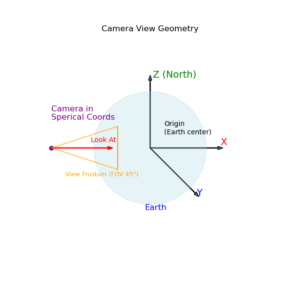

# **PyGlobe Coordinate Systems & Transformation Pipeline**



---

# **1. Overview of Coordinate Systems**

Coordinate systems used in this widget:

1. **Geographic (WGS84)** – latitude, longitude, altitude
2. **ECEF (Earth-Centered Earth-Fixed)** – 3D Cartesian
3. **View / Camera Space** – created via `gluLookAt`
4. **Screen Space (NDC + pixel coordinates)** – post-projection
5. **TMS Tile Space** - Map tiles 

```
WGS84 -> ECEF -> View Space -> Clip -> NDC -> Screen
```

- A good reference for OpenGL coordinate systems: [OpenGL Coordinates](https://learnopengl.com/Getting-started/Coordinate-Systems)

---

# **2. Geographic Coordinates (WGS84)**

**Lat/Lon/Alt**

* **lat** ∈ [−90°, +90°]
* **lon** ∈ [−180°, +180°]
* **alt** in meters above mean sea level

Used for:

* Tile boundaries
* Camera spherical location
* Scene objects defined on Earth’s surface

---

# **3. ECEF (Earth-Centered Earth-Fixed)**

A 3D Cartesian coordinate system:

* Origin at Earth center
* +Z axis through the North Pole
* +X axis at longitude 0°
* +Y axis at longitude +90°

Units: **meters**
 
The globe and scene objects are stored in ECEF.

---

## **3.1 Geographic → ECEF**

### **lla_to_ecef(lat, lon, alt)**

```txt
r = earth_radius + alt
x = r * cos(lat) * cos(lon)
y = r * cos(lat) * sin(lon)
z = r * sin(lat)
```

Used for:

* Tile geometry vertices
* Object placement
* Any conversion from Earth-based coordinates to world coordinates

---

### **spherical_to_ecef(lat, lon, r)**

Used specifically for camera placement:

```txt
x = r * cos(lat) * cos(lon)
y = r * cos(lat) * sin(lon)
z = r * sin(lat)
```

Where **r = distance from Earth center**.

---

# **4. View / Camera Space**

Produced via **gluLookAt**, which computes the camera basis vectors and transforms world coordinates into camera-relative coordinates.

### **Camera setup**

```txt
eye    = (cam_x, cam_y, cam_z)
center = (0, 0, 0)      // always look at Earth center
up     = (0, 0, 1)      // world Z axis
```

Camera orientation:

* Forward = −Z
* Right = +X
* Up = +Y

---

# **5. Screen Space**

After projection (via `gluPerspective`):

* Clip Space: Normalized Device Coordinates (NDC)
* NDC: Pixel coordinates

Ranges:

* **NDC x,y,z ∈ [−1, +1]**
* **Screen x ∈ [0, viewport_width]**
* **Screen y ∈ [0, viewport_height]**

---

# **6. Camera Ray Construction (Inverse Transform)**

The path for mouse picking:

```
Screen -> NDC -> Camera Space Ray -> ECEF Ray
```

### **mouse_to_ray(mouse_x, mouse_y)**

#### 1. Screen → NDC

```txt
ndc_x = (2 * mx) / width  - 1
ndc_y = 1 - (2 * my) / height
```

#### 2. NDC → Camera Space

```txt
ray_cam_x = ndc_x * aspect * tan(fov/2)
ray_cam_y = ndc_y * tan(fov/2)
ray_cam_z = -1
```

#### 3. Camera Space → World (ECEF)

Uses the camera basis vectors:

```txt
forward = normalize(center - eye)
right   = normalize(cross(forward, up))
up      = normalize(cross(right, forward))

ray_world = ray_cam_x * right +
            ray_cam_y * up +
            ray_cam_z * forward
```

**Outputs:**

* **ray_origin**  = camera position in ECEF
* **ray_direction** (normalized)

Used for:

* Interaction picking
* Tile selection
* Object hit testing

---

# **7. Local ENU Tangent Frame**

The ENU frame (East-North-Up) is a local tangent plane at a specific point on Earth.

* Used for orienting objects relative to surface

## **7.1 Basis Vectors (in ECEF)**

```txt
East  = [-sin(lon),              cos(lon),              0]
North = [-sin(lat)*cos(lon), -sin(lat)*sin(lon),  cos(lat)]
Up    = [ cos(lat)*cos(lon),  cos(lat)*sin(lon),  sin(lat)]
```

## **7.2 ENU → ECEF Transformation Matrix**

```txt
R = [ East | North | Up ]
ecef_vec = R @ enu_vec
```

Columns of R:

* Column 0: East
* Column 1: North
* Column 2: Up

---

# **8. Constants & Parameters**

### **Earth Model**

* Earth radius = 6,371,000 m
* Spherical WGS84 approximation

### **Camera**

* Default distance ≈ 20,000,000 m
* FOV = 45 degreees
* Near = 100 km
* Far = 50,000 km

### **Tiles**

* TMS / OSM format
* Zoom levels 3–8

---

# **9. Visual Reference Diagrams**


## **9.1 ECEF Axes**

* +X: Longitude 0°
* +Y: Longitude +90°
* +Z: North pole
* Earth centered

## **9.2 Camera View Geometry**

* Camera in spherical position
* Always looking at Earth center
* View frustum with 45° FOV

---

# **10. Pipeline Summary**

## **Rendering Pipeline**

1. Define geometry in **lat/lon/alt**
2. Convert to **ECEF**
3. Apply **ModelView** transforms -> View Space
4. Apply **Projection** -> NDC -> Screen

## **User Interaction Pipeline**

1. Mouse click in **Screen space**
2. Convert to **NDC**
3. Construct ray in **Camera Space**
4. Transform ray to **ECEF**
5. Perform intersection tests in **ECEF**

